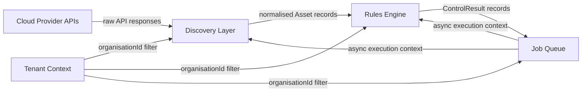
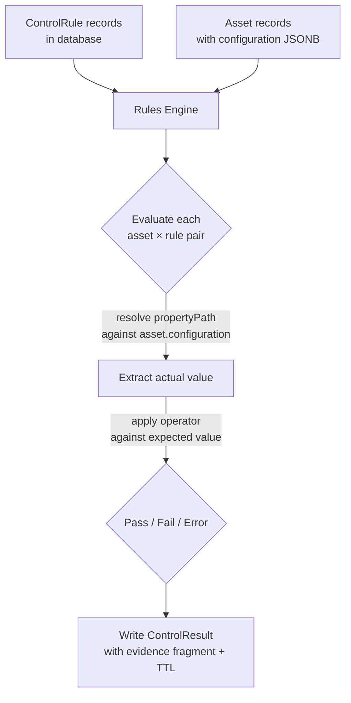
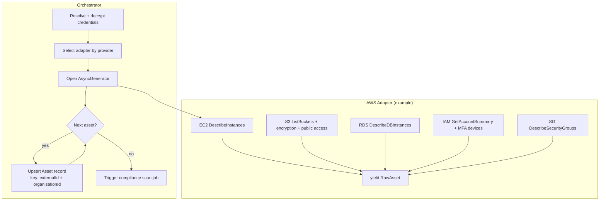
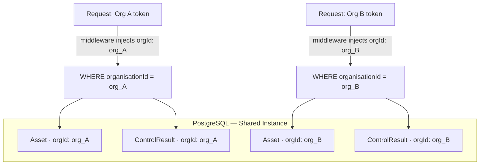
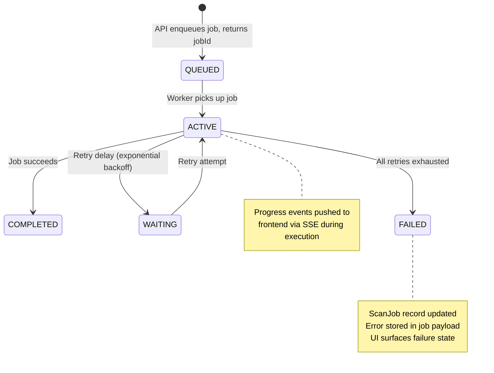

# SecureByte — System Architecture

> **Portfolio Note:** This document describes the internal architecture of SecureByte at the depth a staff engineer would write before and during each build phase. No proprietary source code is included. Pseudocode and schema excerpts are representative of the real implementation.

---

## Table of Contents

1. [Document Scope](#document-scope)
2. [Compliance Rules Engine](#1-compliance-rules-engine)
3. [Multi-Cloud Discovery Layer](#2-multi-cloud-discovery-layer)
4. [Multi-Tenant Isolation Model](#3-multi-tenant-isolation-model)
5. [Async Job & Queue Architecture](#4-async-job--queue-architecture)
6. [Cross-Cutting Concerns](#cross-cutting-concerns)
7. [Known Limitations & Planned Evolution](#known-limitations--planned-evolution)

---

## Document Scope

This document covers four subsystems that form the load-bearing core of SecureByte. Each section explains what the subsystem does, the key design decisions made, and what was considered and rejected. The goal is to make the reasoning behind the architecture legible — not just the architecture itself.

The four subsystems compose into a single workflow:



Every scan starts with discovery, feeds the rules engine, and runs inside a job. Tenant context threads through all three.

---

## 1. Compliance Rules Engine

### High-Level Design

The rules engine is the translation layer between compliance framework language and cloud infrastructure state. Frameworks describe what an organisation must do in human prose. Provider APIs describe what an account has configured in machine-readable JSON. The engine maps one to the other.

The central design decision is that **rules live in the database, not in code.** Each control is a record containing the asset type to check, a JSONPath expression pointing to the relevant property in the provider API response, an operator (e.g. `IS_TRUE`, `EQUALS`, `NOT_CONTAINS`), and an expected value. The engine evaluates these records against discovered assets at scan time.

This makes the system data-driven: adding a new control requires a new database record, not a code change or a deployment. It also enables cross-framework deduplication — one infrastructure fact (e.g. S3 server-side encryption is enabled) can satisfy CIS, POPIA, and ISO 27001 simultaneously without running the same provider API call three times.



### Evaluation Loop

For each scan, the engine receives a set of `Asset` records and the applicable `ControlRule` records for the organisation's enabled frameworks. It evaluates every asset-rule pair and persists a `ControlResult`:

```
for each asset in assets:
  rules = filter(allRules, where rule.assetType === asset.type)

  for each rule in rules:
    actualValue  = resolveJsonPath(asset.configuration, rule.propertyPath)
    status       = evaluate(actualValue, rule.operator, rule.expectedValue)
    staleBefore  = computeTTL(rule.severity)
    // CRITICAL → +1 hr  |  HIGH → +6 hr  |  MEDIUM → +24 hr  |  LOW → +72 hr

    persist ControlResult {
      assetId, ruleId, organisationId,
      status, actualValue, expectedValue,
      scannedAt: now(), staleBefore,
      evidence: extractFragment(asset.configuration, rule.propertyPath)
    }
```

The loop is intentionally simple. Complexity is contained in `resolveJsonPath` and `evaluate`. An unknown operator produces `status: ERROR` with a descriptive message rather than throwing — a single malformed rule cannot fail an entire scan.

The `staleBefore` TTL drives background re-scanning: BullMQ schedules re-evaluation of controls approaching their TTL so the dashboard stays current without full re-scans on every page load.

### Alternatives Considered

**Hardcoded rule functions:** The first prototype implemented each control as a TypeScript function: `checkS3Encryption(asset)`, `checkRDSEncryption(asset)`, and so on. It was fast to build but immediately showed its limits — adding a control required a code change and a deployment. After ten controls it became difficult to maintain. The data-driven DSL replaced it.

**Open Policy Agent / Rego:** OPA is a well-regarded policy engine used in Kubernetes admission control. It was evaluated and rejected on operational grounds: it introduces a separate runtime, a new language with a steep learning curve, and a deployment surface that a solo engineer cannot maintain at speed. The custom operator system covers the same evaluation patterns with zero additional infrastructure.

**JSON Schema validation:** Attractive because it is standardised. Rejected because it cannot express assertions like "this inbound rule array must not permit 0.0.0.0/0 on port 22." The custom operator system handles this; JSON Schema does not.

---

## 2. Multi-Cloud Discovery Layer

### Normalisation Contract

Cloud providers return asset data in incompatible shapes. An AWS S3 bucket description, an Azure Storage Account, and a GCP Cloud Storage bucket represent the same logical concept but differ in property names, nesting depth, and value encoding. The discovery layer produces a single `Asset` shape that the rules engine evaluates regardless of provider origin.

The `Asset` model is the normalisation contract:

```
Asset {
  id, organisationId, externalId    // provider-native ARN or resource ID
  name, type, provider              // normalised enum: S3_BUCKET | RDS_INSTANCE | ...
  region, accountId
  configuration  Json               // raw provider API response stored as JSONB
  tags           Json?
  discoveredAt, lastSeenAt
  deletedAt?                        // soft delete: asset no longer present at provider
}
```

The `configuration` column stores the full, unmodified provider API response. This is deliberate: control rules reference property paths into this raw data, which means adding a new provider property to an existing rule requires no schema migration.

### Provider Adapter Pattern

Each provider is implemented as an adapter satisfying a common interface:

```
interface CloudProviderAdapter {
  provider:       CloudProvider
  discoverAssets: (credentials, scanJob) => AsyncGenerator<RawAsset>
}
```

The `AsyncGenerator` return type allows the orchestrator to upsert assets incrementally as they stream from the provider API. A large AWS account with 300+ resources does not need to load fully into memory before writing begins. It also makes partial scans recoverable: if a job fails mid-way, completed asset upserts are already persisted.



### Alternatives Considered

**Separate table per asset type:** Modelling `S3Bucket`, `EC2Instance`, `RDSInstance` as distinct Prisma models with typed columns was the obvious relational approach. It was rejected because it couples the schema to the current set of supported asset types. Adding a new provider or asset type would require new tables and new migrations. The `Asset` + JSONB `configuration` pattern supports any provider and any asset type without schema changes.

**CSPM API integration (deferred):** Using AWS Security Hub, Azure Defender for Cloud, or GCP Security Command Center as the discovery source was evaluated. The advantage is pre-aggregated findings. The disadvantage is a dependency on the customer having these services enabled and correctly configured — not guaranteed for the SME segment SecureByte targets. Direct provider API calls were chosen for independence.

---

## 3. Multi-Tenant Isolation Model

### Isolation Boundary

Every row of tenant-scoped data carries an `organisationId` foreign key. This is the isolation boundary. All tenants share a single PostgreSQL instance; isolation is enforced at query time, not at the infrastructure level.



### Prisma Middleware Enforcement

Tenant isolation is not a convention applied by individual developers. A Prisma middleware interceptor injects `organisationId` into every query's `where` clause before execution:

```
prisma.$use(async (params, next) => {
  if (!isTenantScoped(params.model)) return next(params)

  const tenantId = currentTenantContext.getOrganisationId()
  if (!tenantId) throw new TenantContextMissingError()

  // Reads: inject filter
  if (isReadOperation(params.action)) {
    params.args.where = { ...params.args.where, organisationId: tenantId }
  }

  // Writes: inject on create; inject filter on update/delete
  if (isWriteOperation(params.action)) {
    params.args = injectTenantOnWrite(params.args, tenantId, params.action)
  }

  return next(params)
})
```

`currentTenantContext` is an async-local storage value set by the authentication middleware at the start of each request. It is ambient — no service-layer code needs to pass the tenant ID as a function argument.

### Admin Context Pattern

Platform-level operations (analytics, billing, health checks) need to query across tenant boundaries. These use an explicit admin Prisma client instantiated without the tenant middleware:

```
// Standard client — tenant middleware enforced
export const prisma      = new PrismaClient().$extends(tenantMiddleware)

// Admin client — no tenant middleware; restricted import path
export const adminPrisma = new PrismaClient()
// Rule: only importable from /apps/api/src/platform/** — enforced by ESLint
```

The admin client is not exported from the shared `packages/db` package and is not accessible to `apps/web`. Import linting rules flag any use of `adminPrisma` outside designated platform service files.

### Alternatives Considered

**PostgreSQL Row-Level Security (deferred):** RLS enforces isolation at the database layer, closer to the data than application middleware. It is the right long-term answer. It was deferred because RLS policies interact in non-obvious ways with Prisma's query generation, add operational complexity to migrations, and require careful testing to verify correctness. The Prisma middleware approach is correct for current scale and does not prevent migrating to RLS later.

**Schema-per-tenant (rejected):** A dedicated PostgreSQL schema per tenant provides hard isolation and simplifies per-tenant backup and restore. It was rejected because it requires dynamic schema provisioning at signup, complicates migration management (every schema change must apply to every tenant), and adds operational overhead that does not make sense below a threshold of customer scale that SecureByte has not yet reached.

---

## 4. Async Job & Queue Architecture

### Why Async by Default

The first working prototype ran AWS asset discovery inside a synchronous Express route handler. For small accounts it worked. For an account with 200 EC2 instances, 50 S3 buckets, and 30 RDS instances it produced a 90-second HTTP timeout and a silent partial scan.

The lesson generalises: any operation that touches an external system will eventually take longer than an HTTP connection can hold. The queue-first architecture treats this as the default case. Route handlers fetch and return data. They do not compute it. If an operation calls an external API, sends an email, generates a file, or processes more than one record at a time, it lives in a job.

### Job Taxonomy

```
CLOUD_DISCOVERY_JOB
  Trigger:   POST /api/cloud/scan
  Work:      Call provider APIs → upsert Asset records
  Priority:  HIGH (user-initiated)
  Timeout:   5 minutes
  Retries:   3 (exponential backoff: 30s → 2m → 8m)

COMPLIANCE_SCAN_JOB
  Trigger:   CLOUD_DISCOVERY_JOB completion, or POST /api/controls/scan-all
  Work:      Evaluate ControlRules against Asset.configuration → write ControlResults
  Priority:  HIGH (user-initiated) | NORMAL (scheduled)
  Timeout:   10 minutes
  Retries:   2 (backoff: 1m → 5m)

REPORT_GENERATION_JOB
  Trigger:   User requests compliance export
  Work:      Aggregate ControlResults → generate PDF/CSV → upload to object storage
  Priority:  NORMAL
  Timeout:   3 minutes
  Retries:   2 (backoff: 30s → 2m)
```

### Job Lifecycle



The `ScanJob` database record mirrors BullMQ job state. This is intentional redundancy: BullMQ's job history has a configurable retention window, but `ScanJob` records are permanent. Historical scan results remain queryable long after BullMQ has purged the job from Redis.

Each job type has a distinct failure mode based on what partial progress means:

- **CLOUD_DISCOVERY_JOB:** Assets upsert incrementally; the upsert is idempotent (keyed on `externalId + organisationId`). On retry, the job re-runs from the beginning safely.
- **COMPLIANCE_SCAN_JOB:** A mid-scan failure produces a `PARTIAL_FAILURE` status. The dashboard renders partial results with a warning indicator — incomplete data is never presented as a complete scan.
- **REPORT_GENERATION_JOB:** All-or-nothing. A partial file has no value. On failure, no output is written and the job retries from scratch.

### Alternatives Considered

**In-process task queue (rejected):** Node.js `setImmediate` or in-memory queues defer work without external dependencies. Rejected because they do not survive process restarts, cannot distribute work across workers, and provide no job state visibility. A crashed process silently loses all queued work.

**AWS SQS / Azure Service Bus (deferred):** Managed queues are operationally simpler than self-hosted Redis. Deferred because BullMQ on Redis provides job priorities, rate limiting, repeatable jobs, and progress events that SQS does not offer at equivalent simplicity. Switching the queue backend later is an infrastructure change and does not require application code changes.

**Polling for job status (rejected):** The first UI polled `GET /api/jobs/:id/status` every two seconds. It produced unnecessary API load during long scans and a laggy experience. Server-Sent Events replaced it: the API pushes progress updates as they occur, there is no WebSocket handshake overhead, and SSE degrades gracefully on disconnect — the client reconnects and fetches current state.

---

## Cross-Cutting Concerns

### Structured Logging

All application logging uses **Pino** in JSON format. Every log entry carries a request-scoped `traceId`, `organisationId`, and `userId` injected by authentication middleware. No log entry contains credential values, personal information, or raw API responses. Job worker logs inherit the `traceId` from the job payload, which threads a single logical operation across the API process and the worker process.

### Error Handling Contract

The API enforces a consistent error response shape through a central error handler:

```json
{
  "success": false,
  "error": {
    "code":    "TENANT_CONTEXT_MISSING",
    "message": "Request attempted without a valid tenant context",
    "traceId": "req_01HXYZ..."
  }
}
```

Error codes are an enum, not free-form strings. The frontend maps codes to user-facing messages and to specific UI behaviour (e.g. `CREDENTIAL_DECRYPTION_FAILED` routes the user to credential settings). Error message copy changes without touching the API contract.

### Request Validation

Every route accepting a request body validates it against a **Zod schema** before the handler executes. Validation failures return a `400` with a structured list of field-level errors. The Zod schema is the source of truth for request shape; OpenAPI spec generation derives from these schemas.

---

## Known Limitations & Planned Evolution

| Limitation | Current State | Planned Evolution |
|---|---|---|
| **Single-region PostgreSQL** | One instance, one region | Read replicas for dashboard queries; multi-region active-passive for DR |
| **Shared-schema tenancy** | `organisationId` column isolation | Migrate high-value tenants to schema-per-tenant on request |
| **AWS-primary discovery** | Azure and GCP adapters are partial | Complete Azure Resource Manager and GCP Asset Inventory coverage |
| **No webhook delivery** | Compliance events are pull-only | Outbound webhooks for SIEM integration (Splunk, Elastic) |
| **Manual POPIA mapping** | POPIA → CIS cross-references maintained in DB | Engage legal review to formalise and publish the mapping |
| **No automated remediation rollback** | Actions are logged but not auto-reversible | Snapshot-before-remediate and one-click rollback per action |

---

<div align="center">

---

**SecureByte Consulting** · Gauteng, South Africa

*[Tebello Mbhele](https://github.com/tebellombhele) — Founding Engineer*

*This document reflects architecture as of Q1 2026. It will be updated as the system evolves.*

</div>
