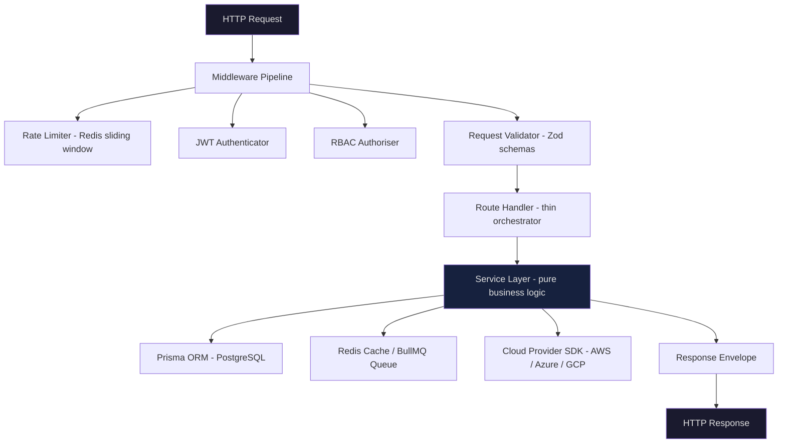
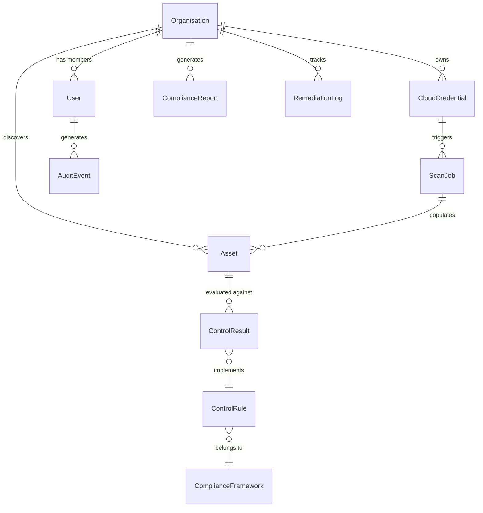
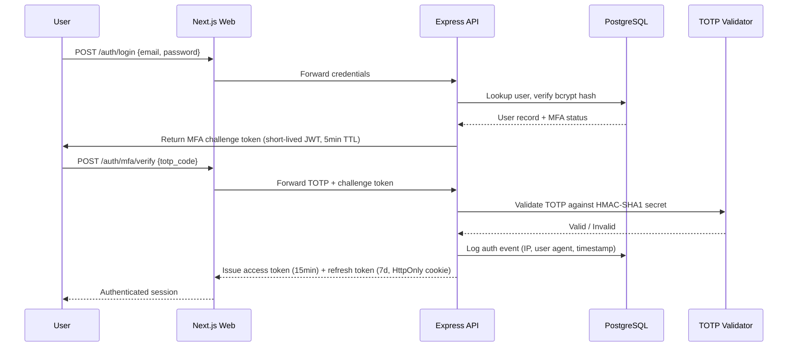
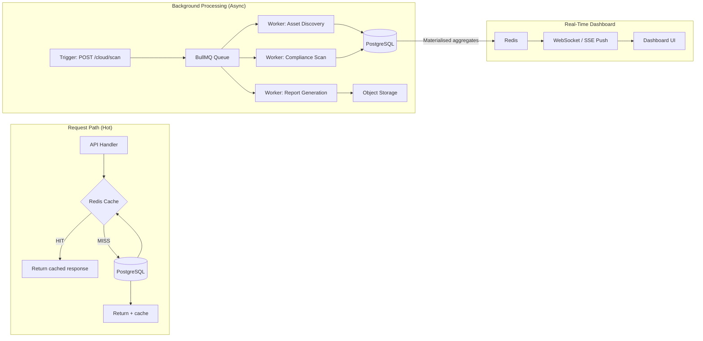
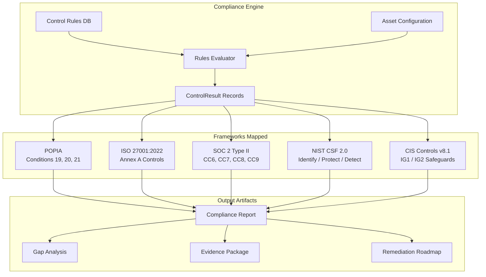
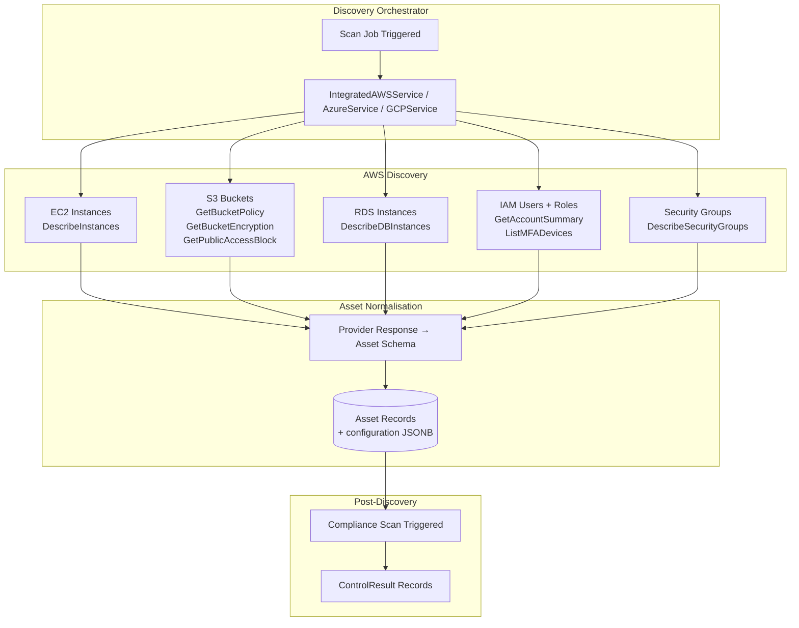

<div align="center">

<br />

```
███████╗███████╗ ██████╗██╗   ██╗██████╗ ███████╗██████╗ ██╗   ██╗████████╗███████╗
██╔════╝██╔════╝██╔════╝██║   ██║██╔══██╗██╔════╝██╔══██╗╚██╗ ██╔╝╚══██╔══╝██╔════╝
███████╗█████╗  ██║     ██║   ██║██████╔╝█████╗  ██████╔╝ ╚████╔╝    ██║   █████╗  
╚════██║██╔══╝  ██║     ██║   ██║██╔══██╗██╔══╝  ██╔══██╗  ╚██╔╝     ██║   ██╔══╝  
███████║███████╗╚██████╗╚██████╔╝██║  ██║███████╗██████╔╝   ██║      ██║   ███████╗
╚══════╝╚══════╝ ╚═════╝ ╚═════╝ ╚═╝  ╚═╝╚══════╝╚═════╝    ╚═╝      ╚═╝   ╚══════╝
```

**Automated Compliance Intelligence for Cloud-Native Enterprises**

[](https://www.typescriptlang.org/)
[](https://nextjs.org/)
[](https://nodejs.org/)
[](https://www.postgresql.org/)
[](https://redis.io/)
[](https://www.prisma.io/)
[]()
[]()

<br/>

> **Portfolio Note:** This repository documents the architecture, engineering decisions, and system design of SecureByte — a proprietary SaaS platform. Source code is not published. This README serves as a technical reference for engineering interviewers, collaborators, and prospective design partners.

<br/>

</div>

---

## Table of Contents

1. [Executive Summary](#-executive-summary)
2. [The Problem Space](#-the-problem-space)
3. [Technical Architecture](#-technical-architecture)
4. [Security Stack](#-security-stack)
5. [Scalability & Performance](#-scalability--performance)
6. [Core Engineering Challenges](#-core-engineering-challenges)
7. [Compliance Framework Coverage](#-compliance-framework-coverage)
8. [Multi-Cloud Discovery Engine](#-multi-cloud-discovery-engine)
9. [DevSecOps Pipeline](#-devsecops-pipeline)
10. [Founding Engineering Philosophy](#-founding-engineering-philosophy)

---

## 📋 Executive Summary

SecureByte is a **cloud-native compliance automation engine** purpose-built for organisations operating under South African and international regulatory mandates. The platform automates the discovery, assessment, and remediation of cloud security posture across AWS, Azure, and GCP — mapping infrastructure state directly to control requirements across five concurrent compliance frameworks:

| Framework | Scope |
|---|---|
| **POPIA** (Protection of Personal Information Act) | South African data privacy — Chapter 3 Conditions for Lawful Processing |
| **ISO/IEC 27001:2022** | International information security management |
| **SOC 2 Type II** | Trust Services Criteria for SaaS providers |
| **NIST CSF 2.0** | US NIST Cybersecurity Framework — Identify, Protect, Detect, Respond, Recover |
| **CIS Controls v8.1** | Center for Internet Security prioritised control implementation |

Rather than positioning itself as a GRC ticketing system, SecureByte functions as a **continuous compliance runtime** — interpreting live infrastructure state, executing automated control tests, surfacing remediation paths, and producing audit-grade evidence packages. The design ethos is zero-manual-overhead: compliance posture is derived from infrastructure truth, not self-reported questionnaires.

The platform targets **South African SMEs and mid-market enterprises** — a segment chronically underserved by expensive international GRC incumbents (Vanta, Drata, Lacework) who neither localise for POPIA nor price accessibly for the regional market.

---

## 🔍 The Problem Space

South African organisations face a compounding regulatory burden that existing tooling fails to address coherently:

```
PROBLEM LANDSCAPE
─────────────────────────────────────────────────────────────────────────

  Regulatory Pressure          Tooling Gap                 Business Cost
  ──────────────────          ───────────                 ─────────────
  POPIA fines up to           International GRC tools     Manual audits:
  R10m or 10 years            don't map to South          2–4 weeks
  imprisonment                African law                 R150k–R500k

  ISO 27001 required          Point solutions silo        Cross-framework
  for enterprise              per framework — no          drift is invisible
  procurement                 unified posture view        until audit time

  Multi-cloud estates         No automated discovery      Engineers maintain
  create invisible            for hybrid SA cloud         spreadsheets as
  compliance drift            deployments                 "compliance evidence"

─────────────────────────────────────────────────────────────────────────
```

SecureByte collapses this complexity into a single automated workflow: **connect cloud → discover assets → evaluate controls → remediate → export evidence**.

---

## 🏗 Technical Architecture

### Monorepo Structure

The platform is structured as a **pnpm workspace monorepo** with strict separation of concerns between application layers and shared packages. This was a deliberate founding decision to enforce module boundaries early and allow independent deployment scaling as the team grows.

```
securebyte/
├── apps/
│   ├── api/                          # Express.js REST API (Node 20+, TypeScript strict)
│   │   ├── src/
│   │   │   ├── routes/               # Versioned route handlers (/api/v1/...)
│   │   │   ├── services/             # Business logic layer (cloud, compliance, remediation)
│   │   │   ├── middleware/           # Auth, rate limiting, request validation
│   │   │   ├── jobs/                 # BullMQ async job processors
│   │   │   └── lib/                  # Shared utilities (crypto, logger, cache)
│   │   └── prisma/                   # Schema, migrations, seed data
│   │
│   └── web/                          # Next.js 15 / React 19 frontend
│       ├── app/                      # App Router with route groups
│       │   ├── (auth)/               # Unauthenticated flows
│       │   ├── (dashboard)/          # Protected tenant workspace
│       │   └── api/                  # Next.js API routes (thin BFF layer)
│       ├── components/               # Atomic design component library
│       ├── hooks/                    # React Query data hooks
│       └── lib/                      # Client-side utilities
│
└── packages/
    ├── db/                           # Prisma client + generated types (shared)
    ├── config/                       # ESLint, TypeScript, Prettier configs
    └── types/                        # Shared domain type definitions
```

**Why a monorepo?** At founding-engineer scale, the primary risk is **type contract drift** between the API and frontend. By sharing the Prisma-generated client and domain types through `packages/db` and `packages/types`, we eliminate an entire class of runtime errors at the compiler level. API response shapes are enforced by the same TypeScript interfaces that the React components consume — no manual synchronisation, no contract drift.

---

### API Layer Architecture

The Express.js API is structured around a **strict three-layer pattern**:



Route handlers are intentionally thin — they validate, authorise, delegate to a service, and return a typed response envelope. All business logic lives exclusively in the service layer, enabling unit testing without HTTP context.

---

### Data Layer — Prisma ORM & Multi-Tenant Isolation

The database schema comprises **40+ Prisma models** designed around a **tenant-scoped row-level isolation** pattern. Every model that carries tenant data includes a mandatory `organisationId` foreign key, enforced at the Prisma schema level — not the application level.



**Key architectural decisions:**

- **No shared schema multi-tenancy.** All tenant data coexists in a single PostgreSQL instance with `organisationId` as the isolation boundary. This allows cost-effective single-instance operation at early scale while the schema design permits eventual migration to schema-per-tenant or database-per-tenant without application rewrites.
- **Encrypted credential storage.** `CloudCredential` records store provider credentials (AWS Access Keys, Azure Service Principal secrets, GCP service account JSON) encrypted at-rest using AES-256-GCM before database write. Prisma middleware intercepts model writes to apply encryption transparently — the service layer never touches plaintext credentials after initial registration.
- **Immutable audit trail.** `AuditEvent` records are append-only by convention and database constraint. No `UPDATE` or `DELETE` is issued against this table — application-level guards and Prisma middleware enforce this.

---

## 🔐 Security Stack

Security is not a layer added on top of SecureByte — it is load-bearing infrastructure that every other system depends on. The following controls were implemented from day one, not retrofitted.

### Encryption Architecture

```
DATA AT REST
──────────────────────────────────────────────────────────────
  Cloud Credentials    →  AES-256-GCM  →  Encrypted blob in PostgreSQL
  Encryption Key       →  Derived via deterministic PBKDF2 (SHA-256 salt)
  IV                   →  Unique per encryption operation (never reused)
  Auth Tag             →  Stored alongside ciphertext for integrity verification

  Why AES-256-GCM over AES-256-CBC:
  GCM mode provides authenticated encryption — any tampering with
  the ciphertext causes decryption to fail with an authentication
  error, not silently corrupt data. This is critical for cloud
  credentials where a tampered key could redirect cloud API calls.

DATA IN TRANSIT
──────────────────────────────────────────────────────────────
  All API traffic      →  TLS 1.3 minimum (HSTS enforced)
  Internal services    →  Mutual TLS (planned: service mesh)
  Secrets in CI/CD     →  Environment variable injection (never committed)
```

### Authentication & Authorisation



**Threat model decisions:**
- **Short-lived access tokens (15 minutes):** Limits the blast radius of a stolen token. Refresh is transparent to the user via silent token rotation.
- **HttpOnly refresh token cookie:** Eliminates XSS token theft. The refresh token is never accessible to JavaScript.
- **TOTP-based 2FA:** Time-based one-time passwords using RFC 6238 are enforced for all users with cloud credential access — not offered as optional.
- **RBAC with explicit permission sets:** Roles (`OWNER`, `ADMIN`, `AUDITOR`, `VIEWER`) map to named permission strings checked in middleware, not ad-hoc conditional logic scattered through route handlers.

### OWASP Top 10 Mitigations

| OWASP Risk | Control Implemented |
|---|---|
| A01 — Broken Access Control | RBAC middleware on every protected route; `organisationId` scoping on all DB queries |
| A02 — Cryptographic Failures | AES-256-GCM for credentials; TLS 1.3; bcrypt (cost 12) for passwords |
| A03 — Injection | Prisma parameterised queries throughout; Zod schema validation on all inputs |
| A05 — Security Misconfiguration | Strict CSP headers; HSTS; no default credentials in any environment |
| A07 — Auth Failures | Brute-force protection via Redis rate limiter (sliding window, per-IP + per-email) |
| A09 — Logging Failures | Structured JSON logging (Pino); immutable audit trail; no sensitive data in logs |

---

## ⚡ Scalability & Performance

### Caching & Queue Architecture



**Why separate scan execution from the request cycle?** Cloud provider API calls (AWS Describe*, Azure Resource Manager, GCP Asset Inventory) are I/O-bound, potentially rate-limited, and can take 30–120 seconds for large accounts. Blocking an HTTP connection for that duration is architecturally indefensible. BullMQ workers process scans asynchronously, with job progress pushed to the frontend via Server-Sent Events. The API returns a `jobId` immediately — the client polls or subscribes for status.

### PostgreSQL Performance Strategy

- **Composite indexes** on `(organisationId, createdAt)` for all paginated list queries — eliminates full-table scans on tenant data
- **Materialised views** for compliance summary statistics (pass/fail ratios per framework) — refreshed incrementally after each scan rather than computed on every dashboard load
- **Connection pooling via PgBouncer** in transaction mode — prevents connection exhaustion under concurrent scan workloads
- **Soft deletes** with `deletedAt` timestamps — preserves audit history while filtering active records at the query layer

### Redis Usage Patterns

```
Purpose                    Key Pattern                    TTL
─────────────────────────────────────────────────────────────
API response cache         cache:{endpoint}:{hash}        5 min
Rate limit counters        rl:{ip}:{window_start}         60 sec
Session refresh tokens     session:{userId}:{jti}         7 days
Job status                 job:{jobId}:status             24 hr
Dashboard aggregates       dashboard:{orgId}:summary      2 min
```

---

## 🧩 Core Engineering Challenges

### Challenge 1 — Mapping South African Law to Machine-Evaluable Controls

**The Problem:**

POPIA's Conditions for Lawful Processing (Sections 11–25) are written in legal prose, not technical specifications. Translating "reasonable security measures" (Section 19) or "data minimisation" into a boolean test against AWS S3 bucket configuration required building a **bespoke control interpretation layer** — there is no existing open-source POPIA control library equivalent to the CIS Benchmark JSON or NIST SP 800-53 machine-readable catalogs.

**The Solution:**

We built an internal **Control Rule DSL** — each rule is a structured record in the database containing:

```
ControlRule {
  code:         string          // e.g. "POPIA-S19-01"
  framework:    Framework       // POPIA | ISO27001 | SOC2 | NIST | CIS
  title:        string          // Human-readable control name
  description:  string          // What is being tested
  assetType:    AssetType       // S3_BUCKET | RDS_INSTANCE | EC2_INSTANCE | ...
  propertyPath: string          // JSONPath into Asset.configuration
  operator:     Operator        // EQUALS | NOT_EQUALS | CONTAINS | IS_TRUE | ...
  expectedValue: string         // The compliant expected value
  severity:     Severity        // CRITICAL | HIGH | MEDIUM | LOW
  remediationSteps: string[]    // Ordered human-readable steps
}
```

The **Compliance Rules Engine** iterates discovered `Asset` records, resolves `asset.configuration` (a JSONB column storing provider-native API responses), evaluates each applicable `ControlRule` against the configuration blob, and writes a `ControlResult` record per asset-control pair.

This design means adding a new control requires **zero code changes** — a new database record is sufficient. The engine is data-driven, not logic-driven.

**Current coverage: 18 automated control codes** across CIS, SOC 2, ISO 27001, and NIST CSF, with POPIA-specific controls mapped to S3, RDS, EC2, IAM, and Security Group asset types.

---

### Challenge 2 — AES-GCM Decryption Stability Across Runtimes

**The Problem:**

During early development, AWS API calls sporadically failed with `AuthenticationError` despite correct credentials being stored. Root cause analysis revealed that the AES-GCM encryption implementation was generating **non-deterministic salts** for the key derivation function on each call, meaning the decryption key derived at retrieval time differed from the encryption key used at storage time — producing silent corruption rather than an explicit decryption failure.

**The Solution:**

Migrated the key derivation to a **deterministic salt strategy** — the PBKDF2 salt is derived from a stable, record-specific identifier (hashed credential ID) rather than a random value. This ensures the same key is derived regardless of when or where decryption occurs. The random component is preserved in the GCM **initialisation vector (IV)**, which is generated fresh per encryption operation and stored alongside the ciphertext — maintaining semantic security while making key derivation stable.

```
Encryption:  plaintext → PBKDF2(masterKey, deterministicSalt) → AES-256-GCM(iv=random) → {ciphertext, iv, authTag}
Decryption:  {ciphertext, iv, authTag} → PBKDF2(masterKey, deterministicSalt) → AES-256-GCM.decrypt → plaintext
```

---

### Challenge 3 — Multi-Tenant Request Isolation Without Schema-Per-Tenant

**The Problem:**

At early startup scale, provisioning a dedicated PostgreSQL schema per tenant is operationally expensive. However, shared-schema multi-tenancy introduces the catastrophic risk of **cross-tenant data leakage** if a single `WHERE` clause is omitted from a query.

**The Solution:**

Every Prisma query that touches tenant-scoped data is wrapped by a **Prisma middleware interceptor** that automatically injects `organisationId` into query `where` clauses before execution. This is not a convention — it is enforced at the ORM middleware layer. A developer cannot accidentally omit the tenant scope because the middleware appends it regardless.

Additionally, integration tests include **cross-tenant boundary assertions** — every tested endpoint is called with a second organisation's authenticated token and asserts that it cannot read or modify the first organisation's resources.

---

## 📊 Compliance Framework Coverage



**POPIA-specific implementation notes:**

POPIA Section 19 ("Security measures regarding personal information") does not prescribe specific technical controls — it requires "appropriate, reasonable technical and organisational measures." SecureByte operationalises this by mapping to the **CIS Controls v8.1 IG1 safeguards** as the minimum baseline, on the legal reasoning that internationally-recognised security baselines constitute reasonable measures under the Act. This interpretation is documented in-product as audit evidence rationale.

---

## ☁️ Multi-Cloud Discovery Engine



**Provider credential model:** Each `CloudCredential` record stores the minimum required permissions for discovery — read-only IAM policies in AWS (`SecurityAudit` managed policy), Reader role in Azure, Viewer role in GCP. The platform explicitly documents that it requires no write permissions for discovery mode. Remediation actions use a **separate, opt-in elevated credential** with specific write permissions scoped to the exact remediation operation — never broad `AdministratorAccess`.

---

## 🔄 DevSecOps Pipeline

```
CI/CD SECURITY GATES
──────────────────────────────────────────────────────────────────
  Stage 1: Static Analysis
    └── TypeScript strict mode (noImplicitAny, strictNullChecks)
    └── ESLint with security plugin (no eval, no dangerouslySetInnerHTML)

  Stage 2: Dependency Scanning
    └── npm audit (fail on HIGH/CRITICAL severity CVEs)
    └── Dependabot automated PRs for dependency updates
    └── Lockfile integrity verification (pnpm lockfile hash)

  Stage 3: Secret Detection
    └── Pre-commit hook: scan for AWS key patterns, private keys, JWTs
    └── Git history scanning on PR open

  Stage 4: Test Gate
    └── Unit tests (service layer, encryption utilities, control engine)
    └── Integration tests (API endpoints with real Prisma test DB)
    └── Cross-tenant boundary tests (isolation assertions)

  Stage 5: Build & Deploy
    └── Docker multi-stage builds (distroless final image)
    └── Environment-specific secret injection (never baked into image)
    └── Database migrations executed as separate pre-deploy step
──────────────────────────────────────────────────────────────────
```

---

## 🧠 Founding Engineering Philosophy

Building SecureByte as a solo founding engineer across ~11 months forced a set of architectural convictions that I would characterise as follows:

**Correctness over velocity, but velocity over perfection.** Every architectural decision has a cost. The AES-GCM encryption layer, the Prisma middleware isolation, the BullMQ async scan pipeline — each adds complexity. The decision to build these correctly from the start reflects the domain: a compliance platform that leaks tenant data or silently corrupts credentials is not just a bug, it is a product-ending event. In security-adjacent software, correctness is a product requirement, not a quality attribute.

**Type systems are architecture documentation.** In a monorepo with shared types, the TypeScript compiler enforces contracts between layers more reliably than any README. The decision to invest in Prisma-generated types, Zod schema validation at API boundaries, and strict TypeScript mode throughout was a force-multiplier for solo development — the compiler surface-area replaced code review bandwidth.

**Async by default, sync by exception.** Any operation that touches an external system (cloud provider APIs, email, PDF generation) lives in a BullMQ job. This was non-negotiable after the first prototype blocked the HTTP event loop during AWS scans. The queue-first architecture makes the system resilient to provider throttling, network partitions, and long-running operations — none of which are recoverable from inside a synchronous request handler.

**The product IS the compliance logic.** The control rules engine is the intellectual core of SecureByte — not the UI, not the authentication system. Architectural decisions were consistently made to protect and extensify this layer. A data-driven rules engine that requires no code changes to add new controls is more valuable than one that is faster to write but harder to extend. This reflects a founding engineering conviction: the competitive moat is in the compliance knowledge encoding, not the infrastructure plumbing.

---

<div align="center">

---

**SecureByte Consulting (Pty) Ltd** · Gauteng, South Africa

*Built by [Tebello Mbhele](https://github.com/TibiMbhele) — Founding Engineer*

[](https://linkedin.com)
[](https://github.com)

*This repository documents architecture and engineering decisions only. No proprietary source code is published here.*

</div>

